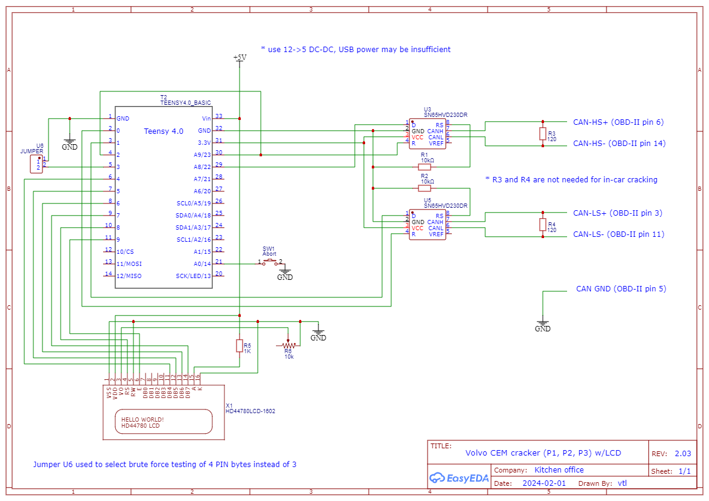

# Volvo CEM pin cracker via OBD

A research project grown out of curiosity. Cracks 6 bytes of pin code via High Speed CAN-bus in under 20 minutes.

## Supported platforms:

* P1:
  * 2004 - 2011 S40
  * 2004 - 2011 V50
  * 2008 - 2013 C30
  * 2006 - 2013 C70
* P2:
  * 2005 - 2006 S80
  * 2005 - 2007 V70
  * 2005 - 2007 XC70
  * 2005 - 2009 S60
  * 2003 - 2014 XC90

Earlier P2 1999-2004 can be supported as well, CEM donation is welcome.

Find us at Matthew's Volvo Site for support: https://www.matthewsvolvosite.com/forums/viewtopic.php?f=10&t=85611

Big thanks to an unidentified hacker from western Germany for hints!


An optional LCD display can be added for stand-alone operation.




Cracking CEM pin in about 10 minutes (video):

[](http://www.youtube.com/watch?v=w8GS_1SFgeg "Cracking CEM pin in about 10 minutes")

## Possible issues and fixes
Depending on your CEM model, you may face some issues with PIN decoding. Here are some examples and recommendations.

### CEM 30786889
#### Unable to decode 3rd byte.
Cracker decodes first 2 bytes, but the third byte is always different so PIN cannot be decoded. For example:

```
Attempt 1:
21:54:30.212 -> Candidate PIN 32 78 79 -- -- -- : brute forcing bytes 3 to 5 (3 bytes), will take up to 646 seconds
...
Attempt 2:
22:30:45.288 -> Candidate PIN 32 78 78 -- -- -- : brute forcing bytes 3 to 5 (3 bytes), will take up to 646 seconds

Attempt 3:
23:06:12.024 -> Candidate PIN 32 78 02 -- -- -- : brute forcing bytes 3 to 5 (3 bytes), will take up to 646 seconds

Attempt 4:
14:26:13.327 -> Candidate PIN 32 78 41 -- -- -- : brute forcing bytes 3 to 5 (3 bytes), will take up to 646 seconds
```

There are two possible solutions that may help:
1. Use brute force for rest of bytes - it may take 18-20 hours. To do it, change the following tunable parameter value to 2:
```
#define CALC_BYTES     3     /* how many PIN bytes to calculate (1 to 4), the rest is brute-forced */
```

2. Another solution that may help - comment out the following line:
```
set_arm_clock (180000000);
```

And to avoid time waste, hardcode the first two bytes that you already know:
```
  /* try and crack each PIN position */
  
  // Add lines to skip first known bytes */
  pin[0] = 0x32; // Known first byte example
  pin[1] = 0x78; // Known second byte example

  // Change initial value of i from 0 to 2
  for (i = 2; i < maxBytes; i++) {
    crackPinPosition (pin, i, verbose);
  }
```
